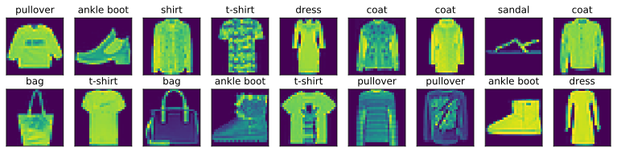

# Image Classification Data (Fashion-MNIST)


```python
%matplotlib inline
import d2l
from mxnet import gluon 
d2l.use_svg_display()
```

Use the provided `FashionMNIST` class to download and load a dataset. 


```python
mnist_train = gluon.data.vision.FashionMNIST(train=True)
mnist_test = gluon.data.vision.FashionMNIST(train=False)

len(mnist_train), len(mnist_test)
```


    (60000, 10000)


Visualize the images


```python
def get_fashion_mnist_labels(labels):
    text_labels = ['t-shirt', 'trouser', 'pullover', 'dress', 'coat',
                   'sandal', 'shirt', 'sneaker', 'bag', 'ankle boot']
    return [text_labels[int(i)] for i in labels]
X, y = mnist_train[:18]
d2l.show_images(X.squeeze(axis=-1), 2, 9, titles=get_fashion_mnist_labels(y));
```





Read a mini-batch


```python
batch_size = 256
transformer = gluon.data.vision.transforms.ToTensor()
train_iter = gluon.data.DataLoader(mnist_train.transform_first(transformer),
                                   batch_size, shuffle=True, num_workers=4)

for X, y in train_iter:
    print(X.shape, y.shape)
    break
```

    (256, 1, 28, 28) (256,)

