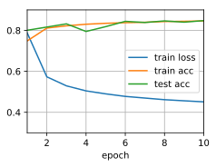

# Concise Implementation of Softmax Regression


```python
import d2l
from mxnet import gluon, init, npx
from mxnet.gluon import nn
npx.set_np()

train_iter, test_iter = d2l.load_data_fashion_mnist(batch_size=256)
```

Model and initialization


```python
net = nn.Sequential()
net.add(nn.Dense(10))
net.initialize(init.Normal(sigma=0.01))
```

Loss function, optimization algorithm and training


```python
loss = gluon.loss.SoftmaxCrossEntropyLoss()
trainer = gluon.Trainer(net.collect_params(), 
                        'sgd', {'learning_rate': 0.1})
d2l.train_ch3(net, train_iter, test_iter, loss, 10, trainer)
```




