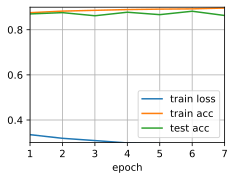

# Concise Implementation of Multilayer Perceptron


```python
import d2l
from mxnet import gluon, npx, init
from mxnet.gluon import nn
npx.set_np()

train_iter, test_iter = d2l.load_data_fashion_mnist(batch_size=256)
```

    Downloading /Users/merlinr/.mxnet/datasets/fashion-mnist/train-images-idx3-ubyte.gz from https://apache-mxnet.s3-accelerate.dualstack.amazonaws.com/gluon/dataset/fashion-mnist/train-images-idx3-ubyte.gz...
    Downloading /Users/merlinr/.mxnet/datasets/fashion-mnist/train-labels-idx1-ubyte.gz from https://apache-mxnet.s3-accelerate.dualstack.amazonaws.com/gluon/dataset/fashion-mnist/train-labels-idx1-ubyte.gz...
    Downloading /Users/merlinr/.mxnet/datasets/fashion-mnist/t10k-images-idx3-ubyte.gz from https://apache-mxnet.s3-accelerate.dualstack.amazonaws.com/gluon/dataset/fashion-mnist/t10k-images-idx3-ubyte.gz...
    Downloading /Users/merlinr/.mxnet/datasets/fashion-mnist/t10k-labels-idx1-ubyte.gz from https://apache-mxnet.s3-accelerate.dualstack.amazonaws.com/gluon/dataset/fashion-mnist/t10k-labels-idx1-ubyte.gz...


The model


```python
net = nn.Sequential()
net.add(nn.Dense(256, activation='relu'),
        nn.Dense(10))
net.initialize(init.Normal(sigma=0.01))
```

Training


```python
loss = gluon.loss.SoftmaxCrossEntropyLoss()
trainer = gluon.Trainer(net.collect_params(), 
                        'sgd', {'learning_rate': 0.5})
d2l.train_ch3(net, train_iter, test_iter, loss, 7, trainer)
```





```python

```
