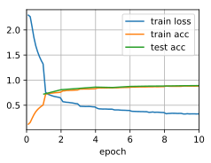

# Deep Convolutional Neural Networks (AlexNet)


```python
import d2l
from mxnet import gluon, np, npx
from mxnet.gluon import nn
npx.set_np()

train_iter, test_iter = d2l.load_data_fashion_mnist(
    batch_size=128, resize=224)
```

The model


```python
net = nn.Sequential()
net.add(# A larger 11 x 11 window to capture large objects.
        nn.Conv2D(96, kernel_size=11, strides=4, activation='relu'),
        nn.MaxPool2D(pool_size=3, strides=2),
        # Make the convolution window smaller, and increase the
        # number of output channels
        nn.Conv2D(256, kernel_size=5, padding=2, activation='relu'),
        nn.MaxPool2D(pool_size=3, strides=2),
        # Use three successive convolutional layers and a smaller convolution
        # window. 
        nn.Conv2D(384, kernel_size=3, padding=1, activation='relu'),
        nn.Conv2D(384, kernel_size=3, padding=1, activation='relu'),
        nn.Conv2D(256, kernel_size=3, padding=1, activation='relu'),
        nn.MaxPool2D(pool_size=3, strides=2),
        # Several times larger fully connected layers with dropout
        nn.Dense(4096, activation="relu"), nn.Dropout(0.5),
        nn.Dense(4096, activation="relu"), nn.Dropout(0.5),
        nn.Dense(10))
```

Check the outputs layer by layer


```python
X = np.random.uniform(size=(1, 1, 224, 224))
net.initialize()
for layer in net:
    X = layer(X)
    print(layer.name, 'output shape:\t', X.shape)
```

    conv0 output shape:	 (1, 96, 54, 54)
    pool0 output shape:	 (1, 96, 26, 26)
    conv1 output shape:	 (1, 256, 26, 26)
    pool1 output shape:	 (1, 256, 12, 12)
    conv2 output shape:	 (1, 384, 12, 12)
    conv3 output shape:	 (1, 384, 12, 12)
    conv4 output shape:	 (1, 256, 12, 12)
    pool2 output shape:	 (1, 256, 5, 5)
    dense0 output shape:	 (1, 4096)
    dropout0 output shape:	 (1, 4096)
    dense1 output shape:	 (1, 4096)
    dropout1 output shape:	 (1, 4096)
    dense2 output shape:	 (1, 10)


Training


```python
d2l.train_ch5(net, train_iter, test_iter, num_epochs=10, lr=0.01)
```

    loss 0.329, train acc 0.880, test acc 0.891
    14578.6 exampes/sec on gpu(0)




