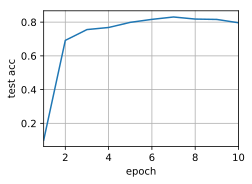
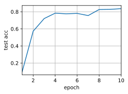

# Multi-GPU Computation Implementation from Scratch


```python
%matplotlib inline
import d2l
from mxnet import autograd, np, npx, gluon
npx.set_np()

!nvidia-smi
```

    Fri Jul  5 23:40:11 2019       
    +-----------------------------------------------------------------------------+
    | NVIDIA-SMI 418.67       Driver Version: 418.67       CUDA Version: 10.1     |
    |-------------------------------+----------------------+----------------------+
    | GPU  Name        Persistence-M| Bus-Id        Disp.A | Volatile Uncorr. ECC |
    | Fan  Temp  Perf  Pwr:Usage/Cap|         Memory-Usage | GPU-Util  Compute M. |
    |===============================+======================+======================|
    |   0  Tesla V100-SXM2...  Off  | 00000000:00:1B.0 Off |                    0 |
    | N/A   47C    P0    54W / 300W |      0MiB / 16130MiB |      0%      Default |
    +-------------------------------+----------------------+----------------------+
    |   1  Tesla V100-SXM2...  Off  | 00000000:00:1C.0 Off |                    0 |
    | N/A   45C    P0    55W / 300W |   2005MiB / 16130MiB |      0%      Default |
    +-------------------------------+----------------------+----------------------+
    |   2  Tesla V100-SXM2...  Off  | 00000000:00:1D.0 Off |                    0 |
    | N/A   46C    P0    58W / 300W |      0MiB / 16130MiB |      4%      Default |
    +-------------------------------+----------------------+----------------------+
    |   3  Tesla V100-SXM2...  Off  | 00000000:00:1E.0 Off |                    0 |
    | N/A   43C    P0    40W / 300W |     11MiB / 16130MiB |      0%      Default |
    +-------------------------------+----------------------+----------------------+
                                                                                   
    +-----------------------------------------------------------------------------+
    | Processes:                                                       GPU Memory |
    |  GPU       PID   Type   Process name                             Usage      |
    |=============================================================================|
    |    1     49887      C   /home/ubuntu/miniconda3/bin/python          1001MiB |
    |    1     59096      C   /home/ubuntu/miniconda3/bin/python           993MiB |
    +-----------------------------------------------------------------------------+


Initializing LeNet.


```python
# Initialize model parameters
scale = 0.01
W1 = np.random.normal(scale=scale, size=(20, 1, 3, 3))
b1 = np.zeros(20)
W2 = np.random.normal(scale=scale, size=(50, 20, 5, 5))
b2 = np.zeros(50)
W3 = np.random.normal(scale=scale, size=(800, 128))
b3 = np.zeros(128)
W4 = np.random.normal(scale=scale, size=(128, 10))
b4 = np.zeros(10)
params = [W1, b1, W2, b2, W3, b3, W4, b4]

# Define the model
def lenet(X, params):
    h1_conv = npx.convolution(data=X, weight=params[0], bias=params[1],
                              kernel=(3, 3), num_filter=20)
    h1_activation = npx.relu(h1_conv)
    h1 = npx.pooling(data=h1_activation, pool_type='avg', kernel=(2, 2),
                    stride=(2, 2))
    h2_conv = npx.convolution(data=h1, weight=params[2], bias=params[3],
                              kernel=(5, 5), num_filter=50)
    h2_activation = npx.relu(h2_conv)
    h2 = npx.pooling(data=h2_activation, pool_type='avg', kernel=(2, 2),
                    stride=(2, 2))
    h2 = h2.reshape((h2.shape[0], -1))
    h3_linear = np.dot(h2, params[4]) + params[5]
    h3 = npx.relu(h3_linear)
    y_hat = np.dot(h3, params[6]) + params[7]
    return y_hat

# Cross-entropy loss function
loss = gluon.loss.SoftmaxCrossEntropyLoss()
```

Copy model parameters to a specific GPU and initializes gradients


```python
def get_params(params, ctx):
    new_params = [p.copyto(ctx) for p in params]
    for p in new_params:
        p.attach_grad()
    return new_params
```

Test


```python
new_params = get_params(params, d2l.try_gpu(0))
print('b1 weight:', new_params[1])
print('b1 grad:', new_params[1].grad)
```

    b1 weight: [0. 0. 0. 0. 0. 0. 0. 0. 0. 0. 0. 0. 0. 0. 0. 0. 0. 0. 0. 0.] @gpu(0)
    b1 grad: [0. 0. 0. 0. 0. 0. 0. 0. 0. 0. 0. 0. 0. 0. 0. 0. 0. 0. 0. 0.] @gpu(0)


Sum the data on all GPUs and then broadcast it


```python
def allreduce(data):
    for i in range(1, len(data)):
        data[0][:] += data[i].copyto(data[0].context)
    for i in range(1, len(data)):
        data[0].copyto(data[i])
```

Test


```python
data = [np.ones((1, 2), ctx=d2l.try_gpu(i)) * (i + 1) for i in range(2)]
print('before allreduce:\n', data[0], '\n', data[1])
allreduce(data)
print('after allreduce:\n', data[0], '\n', data[1])
```

    before allreduce:
     [[1. 1.]] @gpu(0) 
     [[2. 2.]] @gpu(1)
    after allreduce:
     [[3. 3.]] @gpu(0) 
     [[3. 3.]] @gpu(1)


Split a data batch into multiple GPUs


```python
data = np.arange(24).reshape((4, 6))
ctx = d2l.try_all_gpus()
splitted = gluon.utils.split_and_load(data, ctx)
print('input =\n', data)
print('output =\n', splitted[0], '\n', splitted[1])
```

    input =
     [[ 0.  1.  2.  3.  4.  5.]
     [ 6.  7.  8.  9. 10. 11.]
     [12. 13. 14. 15. 16. 17.]
     [18. 19. 20. 21. 22. 23.]]
    output =
     [[ 0.  1.  2.  3.  4.  5.]
     [ 6.  7.  8.  9. 10. 11.]] @gpu(0) 
     [[12. 13. 14. 15. 16. 17.]
     [18. 19. 20. 21. 22. 23.]] @gpu(1)


We need to split both the features and labels


```python
def split_batch(X, y, ctx_list):
    """Split X and y into multiple devices specified by ctx"""
    assert X.shape[0] == y.shape[0]
    return (gluon.utils.split_and_load(X, ctx_list),
            gluon.utils.split_and_load(y, ctx_list))
```

Multi-GPU training on a single mini-batch


```python
def train_batch(X, y, gpu_params, ctx_list, lr):
    gpu_Xs, gpu_ys = split_batch(X, y, ctx_list)
    with autograd.record():  # Loss is calculated separately on each GPU
        ls = [loss(lenet(gpu_X, gpu_W), gpu_y)
              for gpu_X, gpu_y, gpu_W in zip(gpu_Xs, gpu_ys, gpu_params)]
    for l in ls:  # Back Propagation is performed separately on each GPU
        l.backward()
    # Sum all the gradients from each GPU and then broadcast them 
    for i in range(len(gpu_params[0])):
        allreduce([gpu_params[c][i].grad for c in range(len(ctx_list))])
    # The model parameters are updated separately on each GPU
    for param in gpu_params:
        d2l.sgd(param, lr, X.shape[0])  # Here, we use a full-size batch
```

Training function


```python
def train(num_gpus, batch_size, lr):
    train_iter, test_iter = d2l.load_data_fashion_mnist(batch_size)
    ctx_list = [d2l.try_gpu(i) for i in range(num_gpus)]
    # Copy model parameters to num_gpus GPUs
    gpu_params = [get_params(params, c) for c in ctx_list]
    num_epochs, times, acces = 10, [], []
    animator = d2l.Animator('epoch', 'test acc', xlim=[1, num_epochs])
    timer = d2l.Timer()
    for epoch in range(num_epochs):
        timer.start()
        for X, y in train_iter:
            train_batch(X, y, gpu_params, ctx_list, lr)
            npx.waitall()
        timer.stop()
        animator.add(epoch+1, (d2l.evaluate_accuracy_gpu(
            lambda x: lenet(x, gpu_params[0]), test_iter, ctx[0]),))
    print('test acc: %.2f, %.1f sec/epoch on %s' % (
            animator.Y[0][-1], timer.avg(), ctx_list))

```

Training with a singe GPU


```python
train(num_gpus=1, batch_size=256, lr=0.2)
```

    test acc: 0.80, 1.8 sec/epoch on [gpu(0)]





Training with two GPUs


```python
train(num_gpus=2, batch_size=256, lr=0.2)
```

    test acc: 0.84, 2.5 sec/epoch on [gpu(0), gpu(1)]




