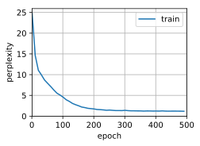

# Concise Implementation of Recurrent Neural Networks


```python
import d2l
import math
from mxnet import gluon, init, np, npx
from mxnet.gluon import nn, rnn
npx.set_np()

batch_size, num_steps = 32, 35
train_iter, vocab = d2l.load_data_time_machine(batch_size, num_steps)
```

Creating a RNN layer with 256 hidden units.


```python
rnn_layer = rnn.RNN(256)
rnn_layer.initialize()
```

Initializing the hidden state.


```python
state = rnn_layer.begin_state(batch_size=1)
len(state), state[0].shape
```


    (1, (1, 1, 256))


Defining a class to wrap the RNN layers


```python
class RNNModel(nn.Block):
    def __init__(self, rnn_layer, vocab_size, **kwargs):
        super(RNNModel, self).__init__(**kwargs)
        self.rnn = rnn_layer
        self.vocab_size = vocab_size
        self.dense = nn.Dense(vocab_size)

    def forward(self, inputs, state):
        X = npx.one_hot(inputs.T, self.vocab_size)
        Y, state = self.rnn(X, state)
        # The fully connected layer will first change the shape of Y to
        # (num_steps * batch_size, num_hiddens)
        # Its output shape is (num_steps * batch_size, vocab_size)
        output = self.dense(Y.reshape((-1, Y.shape[-1])))
        return output, state

    def begin_state(self, *args, **kwargs):
        return self.rnn.begin_state(*args, **kwargs)
```

Training


```python
num_epochs, lr, ctx = 500, 1, d2l.try_gpu()
model = RNNModel(rnn_layer, len(vocab))
model.initialize(force_reinit=True, ctx=ctx)
d2l.train_ch8(model, train_iter, vocab, lr, num_epochs, ctx)
```

    Perplexity 1.2, 158013 tokens/sec on gpu(0)
    time traveller  you can show black is white by argument said fil
    traveller after the pauserequired for the little go the geo




